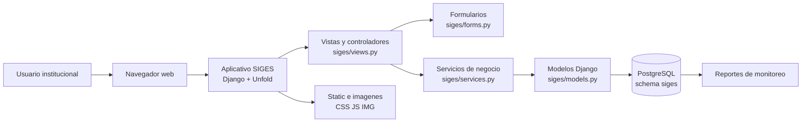
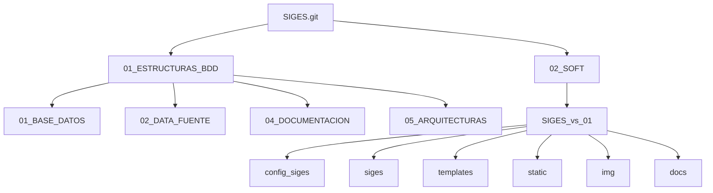
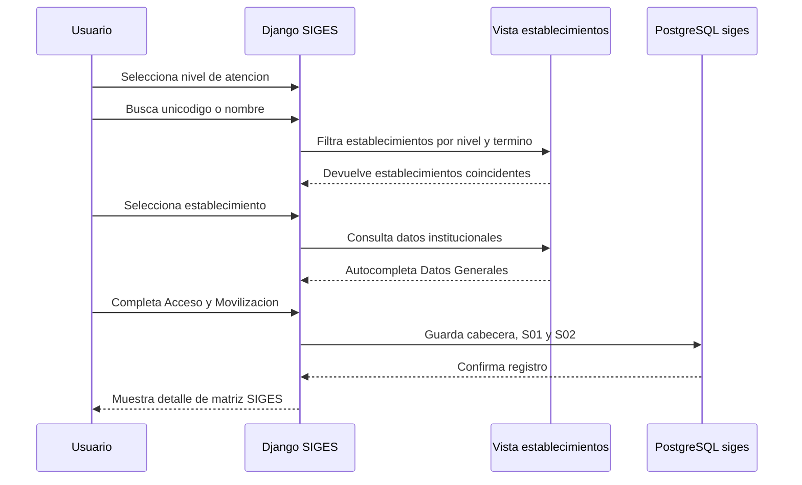
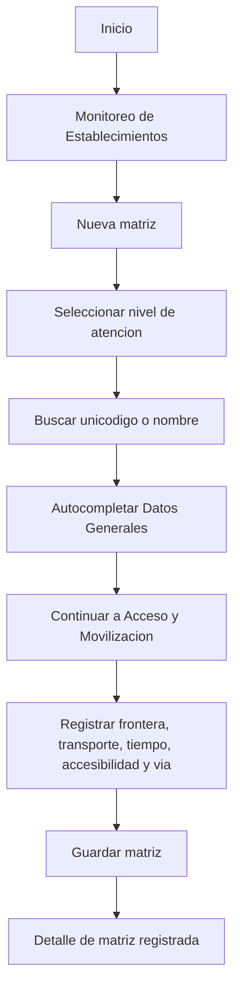

| **Membrete institucional** | **Sistema de Informacion para la Gestion de Establecimientos de Salud - SIGES** |
|---|---|
| **Proyecto** | Red de Proteccion Social |
| **Institucion rectora** | Ministerio de Salud Publica del Ecuador |
| **Cooperante** | Banco Mundial |
| **Consultor Especialista en Proteccion Social** | Marcelo Chavez |
| **Correo electronico** | marcelo_chavez_ec@outlook.com |
| **Movil** | 098 333 2687 |
| **Repositorio** | `marcelochavez-ec/SIGES` |
| **Version documental** | 1.0 |
| **Fecha de actualizacion** | Octubre 2026 |

# SIGES

**Sistema de Informacion para la Gestion de Establecimientos de Salud**

Proyecto institucional para estructurar, registrar, consultar y monitorear informacion de establecimientos de salud del MSP, con una arquitectura basada en PostgreSQL, Django, Django Unfold, Bootstrap, HTML, CSS y JavaScript.

## 1. Identificacion del proyecto

| Campo | Detalle |
|---|---|
| Nombre del aplicativo | SIGES |
| Nombre completo | Sistema de Informacion para la Gestion de Establecimientos de Salud |
| Institucion | Ministerio de Salud Publica del Ecuador |
| Proyecto | Red de Proteccion Social |
| Cooperante | Banco Mundial |
| Creador y consultor | Marcelo Chavez |
| Rol | Consultor Especialista en Proteccion Social |
| Base de datos objetivo | PostgreSQL institucional |
| Schema funcional | `siges` |
| Aplicativo web | Django + Django Unfold |

## 2. De que trata SIGES

SIGES permite registrar matrices de informacion asociadas a establecimientos de salud, iniciando con dos secciones funcionales:

1. **Datos Generales**: identifica el establecimiento mediante nivel de atencion, unicodigo y datos institucionales autocompletados.
2. **Acceso y Movilizacion**: registra condiciones de frontera, movilizacion, transporte publico, tiempo de traslado, accesibilidad territorial y tipo de via.

El sistema esta disenado para crecer por niveles de atencion y por nuevas secciones del formulario, manteniendo separadas la capa de base de datos, la capa del aplicativo Django, los recursos visuales, los scripts de inicializacion y la documentacion tecnica.

## 3. Vista general de arquitectura



## 4. Capas del repositorio



## 5. Flujo funcional principal



## 6. Estructura principal

```text
SIGES_vs_SEPT2026/
├── 01_ESTRUCTURAS_BDD/
│   ├── 01_BASE_DATOS/
│   │   └── 01_NIVEL/
│   │       ├── catalogos_nivel_1.py
│   │       ├── configuracion.py
│   │       ├── ddl_nivel_1.py
│   │       ├── ejecutar_nivel_1.py
│   │       ├── main_siges_nivel_1.py
│   │       └── niveles_atencion.py
│   ├── 02_DATA_FUENTE/
│   ├── 04_DOCUMENTACION/
│   └── 05_ARQUITECTURAS/
│
├── 02_SOFT/
│   └── SIGES_vs_01/
│       ├── config_siges/
│       ├── siges/
│       │   ├── models.py
│       │   ├── forms.py
│       │   ├── views.py
│       │   ├── services.py
│       │   └── management/commands/
│       ├── templates/
│       ├── static/
│       ├── img/
│       ├── docs/
│       ├── deploy_siges.py
│       ├── manage.py
│       └── requirements.txt
│
├── .gitignore
└── README.md
```

## 7. Componentes tecnicos

| Componente | Uso |
|---|---|
| Python | Lenguaje principal del backend y scripts de base de datos |
| Django | Framework web del aplicativo SIGES |
| Django Unfold | Interfaz administrativa y componentes visuales de administracion |
| PostgreSQL | Base institucional de almacenamiento |
| psycopg | Conector Python/PostgreSQL |
| WhiteNoise | Servicio de archivos estaticos en ejecucion simple |
| Waitress | Servidor WSGI para levantar el aplicativo local o en servidor |
| HTML/CSS/JS | Templates, estilos institucionales y comportamiento del frontend |
| Mermaid | Diagramas renderizables en GitHub dentro de Markdown |

## 8. Base de datos

SIGES trabaja sobre PostgreSQL y utiliza el schema funcional:

```text
siges
```

Tablas principales del primer alcance:

| Tabla | Proposito |
|---|---|
| `siges_formulario` | Cabecera de cada matriz registrada |
| `respuesta_s01` | Datos Generales del establecimiento |
| `respuesta_s02` | Acceso y Movilizacion |
| `formulario_seccion` | Catalogo de secciones del formulario |
| `formulario_variable` | Catalogo de variables/preguntas |
| `formulario_opcion` | Opciones de respuesta para preguntas cerradas |
| `formulario_validacion` | Reglas de validacion documentables |
| `vm_establecimientos_ingresados` | Fuente institucional para buscar y autocompletar establecimientos |

## 9. Variables de entorno requeridas

Las credenciales no se versionan. Deben configurarse como variables del ambiente Conda:

| Variable | Descripcion |
|---|---|
| `SIGES_DB_NAME` | Nombre de la base PostgreSQL |
| `SIGES_DB_USER` | Usuario PostgreSQL |
| `SIGES_DB_PASSWORD` | Contrasena PostgreSQL |
| `SIGES_DB_HOST` | Host o IP de PostgreSQL |
| `SIGES_DB_PORT` | Puerto PostgreSQL |
| `SIGES_DB_SCHEMA` | Schema funcional, normalmente `siges` |
| `DJANGO_SECRET_KEY` | Clave Django para ambientes no locales |
| `DJANGO_DEBUG` | `true` en desarrollo, `false` en despliegues controlados |
| `DJANGO_ALLOWED_HOSTS` | Hosts permitidos separados por coma |

## 10. Reproduccion en Windows con Conda

### 10.1. Crear o activar ambiente

```powershell
conda create -n msp_01 python=3.14 -y
conda activate msp_01
```

Si el ambiente `msp_01` ya existe:

```powershell
conda activate msp_01
```

### 10.2. Instalar dependencias

```powershell
cd C:\ruta\al\repositorio\SIGES_vs_SEPT2026\02_SOFT\SIGES_vs_01
python -m pip install --upgrade pip
pip install -r requirements.txt
```

### 10.3. Configurar variables de conexion

```powershell
conda env config vars set SIGES_DB_NAME=productos_bm
conda env config vars set SIGES_DB_USER=usuario_postgresql
conda env config vars set SIGES_DB_PASSWORD="clave_postgresql"
conda env config vars set SIGES_DB_HOST=10.64.100.191
conda env config vars set SIGES_DB_PORT=5432
conda env config vars set SIGES_DB_SCHEMA=siges
conda env config vars set DJANGO_DEBUG=true
conda env config vars set DJANGO_ALLOWED_HOSTS="127.0.0.1,localhost,0.0.0.0"
conda deactivate
conda activate msp_01
```

### 10.4. Verificar Django

```powershell
python manage.py check
```

### 10.5. Cargar catalogos del aplicativo

```powershell
python manage.py cargar_catalogos_siges
```

### 10.6. Levantar aplicativo local

```powershell
python deploy_siges.py
```

Abrir:

```text
http://127.0.0.1:8036/
```

## 11. Reproduccion en AlmaLinux con Conda

### 11.1. Activar ambiente

```bash
conda activate msp_01
```

Si el ambiente no existe:

```bash
conda create -n msp_01 python=3.14 -y
conda activate msp_01
```

### 11.2. Instalar dependencias

```bash
cd /ruta/al/repositorio/SIGES_vs_SEPT2026/02_SOFT/SIGES_vs_01
python -m pip install --upgrade pip
pip install -r requirements.txt
```

### 11.3. Configurar variables

```bash
conda env config vars set SIGES_DB_NAME=productos_bm
conda env config vars set SIGES_DB_USER=usuario_postgresql
conda env config vars set SIGES_DB_PASSWORD="clave_postgresql"
conda env config vars set SIGES_DB_HOST=10.64.100.191
conda env config vars set SIGES_DB_PORT=5432
conda env config vars set SIGES_DB_SCHEMA=siges
conda env config vars set DJANGO_DEBUG=false
conda env config vars set DJANGO_ALLOWED_HOSTS="10.64.100.194,10.64.100.197,localhost,127.0.0.1"
conda deactivate
conda activate msp_01
```

### 11.4. Validar el proyecto

```bash
python manage.py check
python manage.py cargar_catalogos_siges
```

### 11.5. Levantar con Waitress

```bash
python deploy_siges.py
```

Si se requiere levantar manualmente:

```bash
waitress-serve --host=0.0.0.0 --port=8036 config_siges.wsgi:application
```

Abrir desde la red autorizada:

```text
http://IP_DEL_SERVIDOR:8036/
```

## 12. Creacion de estructuras de base de datos

Los scripts de estructura se encuentran en:

```text
01_ESTRUCTURAS_BDD/01_BASE_DATOS/01_NIVEL/
```

Ejecucion principal:

```bash
cd 01_ESTRUCTURAS_BDD/01_BASE_DATOS/01_NIVEL
python main_siges_nivel_1.py
```

Este proceso:

1. Lee la configuracion de conexion.
2. Crea o actualiza tablas del schema `siges`.
3. Carga secciones, variables, opciones y validaciones.
4. Mantiene la ejecucion idempotente para evitar duplicados de catalogo.

## 13. Flujo del formulario



## 14. Comandos utiles

Desde `02_SOFT/SIGES_vs_01`:

```bash
python manage.py check
python manage.py cargar_catalogos_siges
python manage.py collectstatic --noinput
python manage.py createsuperuser
python deploy_siges.py
```

## 15. Documentacion tecnica

La documentacion se mantiene dentro del repositorio:

```text
02_SOFT/SIGES_vs_01/docs/
01_ESTRUCTURAS_BDD/04_DOCUMENTACION/
```

Principales documentos:

| Documento | Contenido |
|---|---|
| `docs/01_arquitectura/arquitectura.md` | Arquitectura del aplicativo |
| `docs/02_base_datos/base_datos.md` | Base de datos y relacion con Django |
| `docs/04_formulario/formulario_siges.md` | Flujo del formulario |
| `docs/06_modulos/establecimientos.md` | Modulo de establecimientos |
| `docs/06_modulos/reportes_monitoreo.md` | Dashboard de monitoreo |
| `01_ESTRUCTURAS_BDD/04_DOCUMENTACION/01_NIVEL/base_datos_nivel_1.md` | Capa de base de datos nivel 1 |

## 16. Consideraciones de seguridad

1. No versionar credenciales reales.
2. No subir archivos `.env`, `config.yml` con claves ni respaldos locales.
3. Mantener `DJANGO_DEBUG=false` en ambientes compartidos o institucionales.
4. Configurar `DJANGO_ALLOWED_HOSTS` con los hosts reales de despliegue.
5. Controlar el puerto `8036` mediante firewall solo en servidores autorizados.

## 17. Pruebas minimas sugeridas

Antes de publicar o mover a otro servidor:

```bash
python manage.py check
python manage.py cargar_catalogos_siges
python manage.py collectstatic --noinput
```

Validar en navegador:

1. `/`
2. `/establecimientos/`
3. `/matriz/nueva/?paso=s01`
4. Creacion de una matriz de prueba.
5. Edicion de una matriz existente.
6. Visualizacion del detalle.
7. Acceso al modulo de roles y usuarios.
8. Acceso al modulo de reportes de monitoreo.

## 18. Estado actual

El repositorio contiene:

1. Scripts de base de datos para el primer nivel.
2. Aplicativo Django SIGES funcional.
3. Formularios S01 y S02.
4. Catalogos y validaciones del formulario.
5. Interfaz institucional responsive.
6. Dashboard de reportes de monitoreo.
7. Documentacion tecnica por modulo.
