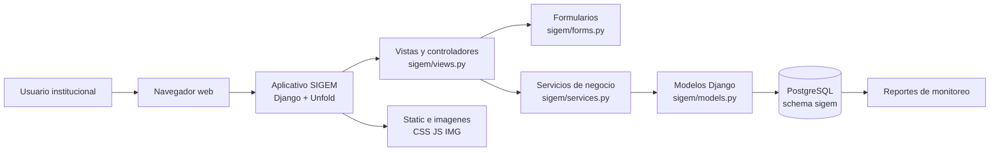
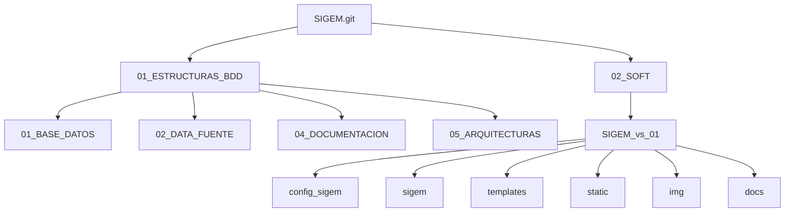
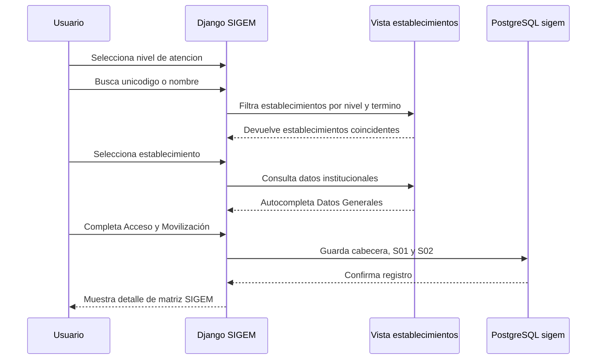

| **Producto** | **Sistema de Gestión y Monitoreo de los Establecimientos de Salud - SIGEM** |
|---|---|
| **Proyecto** | Red de Protección Social |
| **Institución rectora** | Ministerio de Salud Pública del Ecuador |
| **Cooperante** | Banco Mundial |
| **Consultor Especialista en Protección Social** | Marcelo Chávez |
| **Correo electrónico** | marcelo_chavez_ec@outlook.com |
| **Móvil** | 098 333 2687 |
| **Repositorio** | `marcelochavez-ec/SIGEM` |
| **Versión documental** | 1.0 |
| **Versión del software** | 0.1 |
| **Fecha de actualización** | Octubre 2026 |

# SIGEM

**Sistema de Gestión y Monitoreo de los Establecimientos de Salud**

Proyecto institucional para estructurar, registrar, consultar y monitorear información de establecimientos de salud del MSP, con una arquitectura basada en PostgreSQL, Django, Django Unfold, Bootstrap, HTML, CSS y JavaScript.

## 1. Identificación del proyecto

| Campo | Detalle |
|---|---|
| Nombre del aplicativo | SIGEM |
| Nombre completo | Sistema de Información para la Gestión y Monitoreo de los Establecimientos de Salud |
| Institución | Ministerio de Salud Pública del Ecuador |
| Proyecto | Red de Protección Social |
| Cooperante | Banco Mundial |
| Creador y consultor | Marcelo Chávez |
| Rol | Consultor Especialista en Protección Social |
| Base de datos objetivo | PostgreSQL institucional |
| Schema funcional | `sigem` |
| Aplicativo web | Django + Django Unfold |

## 2. De qué trata SIGEM

SIGEM permite registrar matrices de información asociadas a establecimientos de salud, iniciando con dos secciones funcionales:

1. **Datos Generales**: identifica el establecimiento mediante nivel de atención, unicódigo y datos institucionales autocompletados.
2. **Acceso y Movilización**: registra condiciones de frontera, movilización, transporte público, tiempo de traslado, accesibilidad territorial y tipo de vía.

El sistema está diseñado para crecer por niveles de atención y por nuevas secciones del formulario, manteniendo separadas la capa de base de datos, la capa del aplicativo Django, los recursos visuales, los scripts de inicialización y la documentación técnica.

## 3. Vista general de arquitectura



## 4. Capas del repositorio



## 5. Flujo funcional principal



## 6. Estructura principal

```text
SIGEM_vs_SEPT2026/
├── 01_ESTRUCTURAS_BDD/
│   ├── 01_BASE_DATOS/
│   │   └── 01_NIVEL/
│   │       ├── paso_00_main_sigem_nivel_1.py
│   │       ├── paso_01_configuracion.py
│   │       ├── paso_02_catalogos_nivel_1.py
│   │       ├── paso_03_niveles_atencion.py
│   │       ├── paso_04_ddl_nivel_1.py
│   │       └── paso_05_ejecutar_nivel_1.py
│   ├── 02_DATA_FUENTE/
│   ├── 04_DOCUMENTACION/
│   └── 05_ARQUITECTURAS/
│
├── 02_SOFT/
│   └── SIGEM_vs_01/
│       ├── config_sigem/
│       ├── sigem/
│       │   ├── models.py
│       │   ├── forms.py
│       │   ├── views.py
│       │   ├── services.py
│       │   └── management/commands/
│       ├── templates/
│       ├── static/
│       ├── img/
│       ├── docs/
│       ├── deploy_sigem.py
│       ├── manage.py
│       └── requirements.txt
│
├── .gitignore
└── README.md
```

## 7. Componentes técnicos

| Componente | Uso |
|---|---|
| Python | Lenguaje principal del backend y scripts de base de datos |
| Django | Framework web del aplicativo SIGEM |
| Django Unfold | Interfaz administrativa y componentes visuales de administración |
| PostgreSQL | Base institucional de almacenamiento |
| psycopg | Conector Python/PostgreSQL |
| WhiteNoise | Servicio de archivos estáticos en ejecución simple |
| Waitress | Servidor WSGI para levantar el aplicativo local o en servidor |
| HTML/CSS/JS | Templates, estilos institucionales y comportamiento del frontend |
| Mermaid | Diagramas renderizables en GitHub dentro de Markdown |

## 8. Base de datos

SIGEM trabaja sobre PostgreSQL y utiliza el schema funcional:

```text
sigem
```

Tablas principales del primer alcance:

| Tabla | Proposito |
|---|---|
| `sigem_formulario` | Cabecera de cada matriz registrada |
| `respuesta_s01` | Datos Generales del establecimiento |
| `respuesta_s02` | Acceso y Movilización |
| `formulario_seccion` | Catálogo de secciones del formulario |
| `formulario_variable` | Catálogo de variables/preguntas |
| `formulario_opcion` | Opciones de respuesta para preguntas cerradas |
| `formulario_validacion` | Reglas de validación documentables |
| `vm_establecimientos_ingresados` | Fuente institucional para buscar y autocompletar establecimientos |

## 9. Variables de entorno requeridas

Las credenciales no se versionan. Deben configurarse como variables del ambiente Conda:

| Variable | Descripción |
|---|---|
| `SIGEM_DB_NAME` | Nombre de la base PostgreSQL |
| `SIGEM_DB_USER` | Usuario PostgreSQL |
| `SIGEM_DB_PASSWORD` | Contrasena PostgreSQL |
| `SIGEM_DB_HOST` | Host o IP de PostgreSQL |
| `SIGEM_DB_PORT` | Puerto PostgreSQL |
| `SIGEM_DB_SCHEMA` | Schema funcional, normalmente `sigem` |
| `DJANGO_SECRET_KEY` | Clave Django para ambientes no locales |
| `DJANGO_DEBUG` | `true` en desarrollo, `false` en despliegues controlados |
| `DJANGO_ALLOWED_HOSTS` | Hosts permitidos separados por coma |

## 10. Reproduccion en Windows con Conda

### 10.1. Crear o activar ambiente

```powershell
conda create -n msp_01 python=3.14 -y
conda activate msp_01
```

Si el ambiente `msp_01` ya existe:

```powershell
conda activate msp_01
```

### 10.2. Instalar dependencias

```powershell
cd C:\ruta\al\repositorio\SIGEM_vs_SEPT2026\02_SOFT\SIGEM_vs_01
python -m pip install --upgrade pip
pip install -r requirements.txt
```

### 10.3. Configurar variables de conexión

```powershell
conda env config vars set SIGEM_DB_NAME=productos_bm
conda env config vars set SIGEM_DB_USER=usuario_postgresql
conda env config vars set SIGEM_DB_PASSWORD="clave_postgresql"
conda env config vars set SIGEM_DB_HOST=10.64.100.191
conda env config vars set SIGEM_DB_PORT=5432
conda env config vars set SIGEM_DB_SCHEMA=sigem
conda env config vars set DJANGO_DEBUG=true
conda env config vars set DJANGO_ALLOWED_HOSTS="127.0.0.1,localhost,0.0.0.0"
conda deactivate
conda activate msp_01
```

### 10.4. Verificar Django

```powershell
python manage.py check
```

### 10.5. Cargar catálogos del aplicativo

```powershell
python manage.py cargar_catalogos_sigem
```

### 10.6. Levantar aplicativo local

```powershell
python deploy_sigem.py
```

Abrir:

```text
http://127.0.0.1:8036/
```

## 11. Reproduccion en AlmaLinux con Conda

### 11.1. Activar ambiente

```bash
conda activate msp_01
```

Si el ambiente no existe:

```bash
conda create -n msp_01 python=3.14 -y
conda activate msp_01
```

### 11.2. Instalar dependencias

```bash
cd /ruta/al/repositorio/SIGEM_vs_SEPT2026/02_SOFT/SIGEM_vs_01
python -m pip install --upgrade pip
pip install -r requirements.txt
```

### 11.3. Configurar variables

```bash
conda env config vars set SIGEM_DB_NAME=productos_bm
conda env config vars set SIGEM_DB_USER=usuario_postgresql
conda env config vars set SIGEM_DB_PASSWORD="clave_postgresql"
conda env config vars set SIGEM_DB_HOST=10.64.100.191
conda env config vars set SIGEM_DB_PORT=5432
conda env config vars set SIGEM_DB_SCHEMA=sigem
conda env config vars set DJANGO_DEBUG=false
conda env config vars set DJANGO_ALLOWED_HOSTS="10.64.100.194,10.64.100.197,localhost,127.0.0.1"
conda deactivate
conda activate msp_01
```

### 11.4. Validar el proyecto

```bash
python manage.py check
python manage.py cargar_catalogos_sigem
```

### 11.5. Levantar con Waitress

```bash
python deploy_sigem.py
```

Si se requiere levantar manualmente:

```bash
waitress-serve --host=0.0.0.0 --port=8036 config_sigem.wsgi:application
```

Abrir desde la red autorizada:

```text
http://IP_DEL_SERVIDOR:8036/
```

## 12. Creación de estructuras de base de datos

Los scripts de estructura se encuentran en:

```text
01_ESTRUCTURAS_BDD/01_BASE_DATOS/01_NIVEL/
```

Ejecución principal:

```bash
cd 01_ESTRUCTURAS_BDD/01_BASE_DATOS/01_NIVEL
python paso_00_main_sigem_nivel_1.py
```

Este proceso:

1. Lee la configuración de conexión.
2. Crea o actualiza tablas del schema `sigem`.
3. Carga secciones, variables, opciones y validaciones.
4. Mantiene la ejecución idempotente para evitar duplicados de catálogo.

## 13. Flujo del formulario


## 14. Comandos útiles

Desde `02_SOFT/SIGEM_vs_01`:

```bash
python manage.py check
python manage.py cargar_catalogos_sigem
python manage.py collectstatic --noinput
python manage.py createsuperuser
python deploy_sigem.py
```

## 15. Sincronización con GitHub desde Windows

Esta sección describe la receta operativa para replicar, ejecutar, desplegar y sincronizar el proyecto SIGEM con el repositorio oficial:

```text
https://github.com/marcelochavez-ec/SIGEM.git
```

### 15.1. Replicar el proyecto en otro Windows 11

Abrir PowerShell en la carpeta donde se almacenará el proyecto y clonar el repositorio:

```powershell
cd C:\Users\USUARIO\Documents
git clone https://github.com/marcelochavez-ec/SIGEM.git
cd SIGEM
```

Si el repositorio ya existe en el equipo, actualizarlo:

```powershell
cd C:\Users\USUARIO\Documents\SIGEM
git pull --rebase origin main
```

### 15.2. Crear o activar el ambiente Conda `msp_01` en Windows

Crear el ambiente si no existe:

```powershell
conda create -n msp_01 python=3.14 -y
conda activate msp_01
```

Activarlo si ya existe:

```powershell
conda activate msp_01
```

Instalar la paquetería requerida:

```powershell
cd C:\Users\USUARIO\Documents\SIGEM\02_SOFT\SIGEM_vs_01
python -m pip install --upgrade pip
pip install -r requirements.txt
```

Versiones base del aplicativo:

```text
Django==6.1.1
django-unfold==0.108.0
psycopg[binary]>=3.2,<4.0
whitenoise>=6.8,<7.0
waitress>=3.0,<4.0
```

### 15.3. Configurar credenciales y conexión PostgreSQL en Windows

El aplicativo puede leer la conexión desde variables persistidas en Conda:

```powershell
conda env config vars set SIGEM_DB_NAME=productos_bm
conda env config vars set SIGEM_DB_USER=usuario_postgresql
conda env config vars set SIGEM_DB_PASSWORD="clave_postgresql"
conda env config vars set SIGEM_DB_HOST=10.64.100.191
conda env config vars set SIGEM_DB_PORT=5432
conda env config vars set SIGEM_DB_SCHEMA=sigem
conda env config vars set DJANGO_DEBUG=true
conda env config vars set DJANGO_ALLOWED_HOSTS="127.0.0.1,localhost,0.0.0.0"
conda deactivate
conda activate msp_01
```

También puede usarse el archivo de configuración de base de datos:

```text
01_ESTRUCTURAS_BDD/03_CONFIGURACIONES/config.yml
```

Ese archivo debe contener el bloque PostgreSQL institucional usado por los scripts de estructura.

### 15.4. Crear o actualizar estructuras de base de datos

Desde la raíz del repositorio:

```powershell
cd C:\Users\USUARIO\Documents\SIGEM
conda activate msp_01
python 01_ESTRUCTURAS_BDD\01_BASE_DATOS\01_NIVEL\paso_00_main_sigem_nivel_1.py
```

El proceso crea o actualiza el esquema `sigem`, las tablas maestras, las tablas de respuesta, validaciones, índices, funciones, triggers y la vista de catálogo del nivel 1.

### 15.5. Validar y levantar SIGEM en Windows

Desde la carpeta del aplicativo:

```powershell
cd C:\Users\USUARIO\Documents\SIGEM\02_SOFT\SIGEM_vs_01
conda activate msp_01
python manage.py check
python manage.py cargar_catalogos_sigem
python deploy_sigem.py
```

Abrir en navegador:

```text
http://127.0.0.1:8036/
```

### 15.6. Desplegar en AlmaLinux con Conda

Ingresar al servidor y clonar o actualizar el repositorio:

```bash
cd /home/marcelo.chavez
git clone https://github.com/marcelochavez-ec/SIGEM.git
cd SIGEM
```

Si el repositorio ya existe:

```bash
cd /home/marcelo.chavez/SIGEM
git pull --rebase origin main
```

Activar o crear el ambiente:

```bash
conda activate msp_01
```

Si no existe:

```bash
conda create -n msp_01 python=3.14 -y
conda activate msp_01
```

Instalar dependencias:

```bash
cd /home/marcelo.chavez/SIGEM/02_SOFT/SIGEM_vs_01
python -m pip install --upgrade pip
pip install -r requirements.txt
```

Configurar variables de entorno:

```bash
conda env config vars set SIGEM_DB_NAME=productos_bm
conda env config vars set SIGEM_DB_USER=usuario_postgresql
conda env config vars set SIGEM_DB_PASSWORD="clave_postgresql"
conda env config vars set SIGEM_DB_HOST=10.64.100.191
conda env config vars set SIGEM_DB_PORT=5432
conda env config vars set SIGEM_DB_SCHEMA=sigem
conda env config vars set DJANGO_DEBUG=false
conda env config vars set DJANGO_ALLOWED_HOSTS="10.64.100.194,10.64.100.197,localhost,127.0.0.1,0.0.0.0"
conda deactivate
conda activate msp_01
```

Crear o actualizar estructuras de base de datos:

```bash
cd /home/marcelo.chavez/SIGEM
python 01_ESTRUCTURAS_BDD/01_BASE_DATOS/01_NIVEL/paso_00_main_sigem_nivel_1.py
```

Validar y levantar:

```bash
cd /home/marcelo.chavez/SIGEM/02_SOFT/SIGEM_vs_01
python manage.py check
python manage.py cargar_catalogos_sigem
python deploy_sigem.py
```

Levantamiento manual alternativo:

```bash
waitress-serve --host=0.0.0.0 --port=8036 config_sigem.wsgi:application
```

Abrir desde un navegador autorizado:

```text
http://10.64.100.194:8036/
http://10.64.100.197:8036/
```

Si el firewall está activo, habilitar el puerto:

```bash
sudo firewall-cmd --zone=public --add-port=8036/tcp --permanent
sudo firewall-cmd --reload
sudo firewall-cmd --zone=public --list-ports
```

### 15.7. Sincronizar cambios locales hacia GitHub

Ubicarse en la raíz del repositorio local:

```powershell
cd C:\Users\MARCELO\OneDrive\Documentos\MSP\14_SEP2026\SIGEM_vs_SEPT2026
```

Confirmar que el remoto apunte al repositorio oficial:

```powershell
git remote -v
```

El resultado esperado debe apuntar a:

```text
https://github.com/marcelochavez-ec/SIGEM.git
```

Si el remoto no corresponde, configurarlo con:

```powershell
git remote set-url origin https://github.com/marcelochavez-ec/SIGEM.git
```

Revisar el estado general:

```powershell
git status --short --branch
```

Revisar diferencias de contenido:

```powershell
git diff
```

Revisar archivos nuevos que Git todavía no rastrea:

```powershell
git status --short
```

Traer cambios remotos sin sobrescribir trabajo local:

```powershell
git pull --rebase origin main
```

Si Git informa conflictos, resolverlos manualmente, guardar los archivos corregidos y continuar con:

```powershell
git add archivo_corregido
git rebase --continue
```

Agregar los cambios según la configuración actual del repositorio:

```powershell
git add -A
```

Después de agregar, confirmar qué quedó preparado:

```powershell
git status --short
```

Crear un commit con un mensaje claro:

```powershell
git commit -m "Describe brevemente el cambio realizado"
```

Ejemplo:

```powershell
git commit -m "Actualiza documentación y sincroniza cambios del aplicativo"
```

Enviar la rama local `main` al repositorio oficial:

```powershell
git push origin main
```

Verificar que el estado local quede limpio:

```powershell
git status --short --branch
```

Verificar que el último commit local coincida con GitHub:

```powershell
git rev-parse HEAD
git ls-remote --heads origin main
```

Los dos identificadores deben coincidir.

## 16. Documentación técnica

La documentación se mantiene dentro del repositorio:

```text
02_SOFT/SIGEM_vs_01/docs/
01_ESTRUCTURAS_BDD/04_DOCUMENTACION/
```

Principales documentos:

| Documento | Contenido |
|---|---|
| `docs/01_arquitectura/arquitectura.md` | Arquitectura del aplicativo |
| `docs/02_base_datos/base_datos.md` | Base de datos y relación con Django |
| `docs/04_formulario/formulario_sigem.md` | Flujo del formulario |
| `docs/06_modulos/establecimientos.md` | Módulo de establecimientos |
| `docs/06_modulos/reportes_monitoreo.md` | Dashboard de monitoreo |
| `01_ESTRUCTURAS_BDD/04_DOCUMENTACION/01_NIVEL/base_datos_nivel_1.md` | Capa de base de datos nivel 1 |

### Norma ortográfica institucional

La documentación técnica, funcional, de base de datos, backend y frontend debe escribirse en español técnico claro y con las tildes que correspondan según cada palabra. Esta regla aplica a README, documentos Markdown, comentarios, docstrings, etiquetas visibles, textos de ayuda, títulos, mensajes de interfaz y documentación de módulos.

Los identificadores técnicos se mantienen exactamente como fueron definidos cuando una tilde pueda romper una referencia, por ejemplo nombres de variables, columnas, rutas, comandos, claves de configuración, migraciones o campos de base de datos como `unicodigo`, `nivel_atencion` o `fecha_actualizacion`.

## 17. Consideraciones de seguridad

1. No versionar credenciales reales.
2. No subir archivos `.env`, `config.yml` con claves ni respaldos locales.
3. Mantener `DJANGO_DEBUG=false` en ambientes compartidos o institucionales.
4. Configurar `DJANGO_ALLOWED_HOSTS` con los hosts reales de despliegue.
5. Controlar el puerto `8036` mediante firewall solo en servidores autorizados.

## 18. Pruebas mínimas sugeridas

Antes de publicar o mover a otro servidor:

```bash
python manage.py check
python manage.py cargar_catalogos_sigem
python manage.py collectstatic --noinput
```

Validar en navegador:

1. `/`
2. `/establecimientos/`
3. `/matriz/nueva/?paso=s01`
4. Creación de una matriz de prueba.
5. Edición de una matriz existente.
6. Visualización del detalle.
7. Acceso al módulo de roles y usuarios.
8. Acceso al módulo de reportes de monitoreo.

## 19. Estado actual

El repositorio contiene:

1. Scripts de base de datos para el primer nivel.
2. Aplicativo Django SIGEM funcional.
3. Formularios S01 y S02.
4. Catálogos y validaciones del formulario.
5. Interfaz institucional responsive.
6. Dashboard de reportes de monitoreo.
7. Documentación técnica por módulo.
